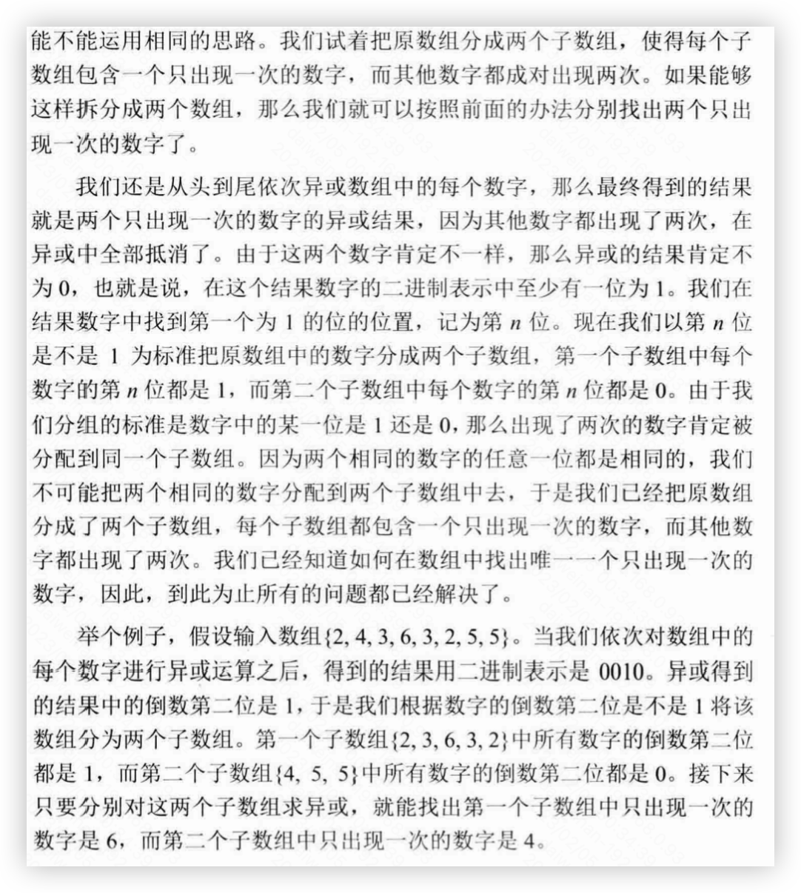

# 260. Single Number III



```java
class Solution {
    public int[] singleNumber(int[] nums) {
        int ans=0;
        for(int i=0;i<nums.length;i++){
            ans^=nums[i];
        }
        int move=0;
        while((ans&1)==0){
            ans=ans>>1;
            move++;
        }
        int[] res=new int[2];
        for(int i=0;i<nums.length;i++){
            if(((nums[i]>>move)&1)==1){
                res[0]^=nums[i];
            }else{
                res[1]^=nums[i];
            }
        }
        return res;
    }
}
```
